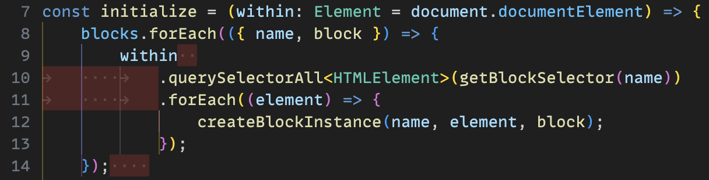

# Strict Whitespace

This extension highlights poor whitespace in documents, letting you quickly discover unnecessary trailing whitespace and indentation that mixes tabs and spaces on the same lines.

## Features

- Highlights inconsistent whitespace in indentation
- Highlights unnecessary trailing whitespace
- Render whitespace in highlighted ranges (enabled with the `strictWhitespace.renderWhitespace` setting)

## Extension Settings

- `strictWhitespace.disableMixedIndentation`: Disable the highlights for mixed indentation.
- `strictWhitespace.disableTrailingWhitespace`: Disable the highlights for trailing whitespace.
- `strictWhitespace.renderWhitespace`: Render whitespace inside highlights.
- `strictWhitespace.colorCustomizations.highlight.background`: Background color of the highlights.
- `strictWhitespace.colorCustomizations.whitespace.foreground`: Color of rendered whitespace inside highlights.
- `strictWhitespace.colorCustomizations.overviewRuler.foreground`: Overview ruler color for the highlights.

## Known Issues

When `strictWhitespace.renderWhitespace` is set to `true` and `editor.renderWhitespace` is set to a value other than `all` or `none`, this extension’s rendered whitespace will overlap that of the editor.
